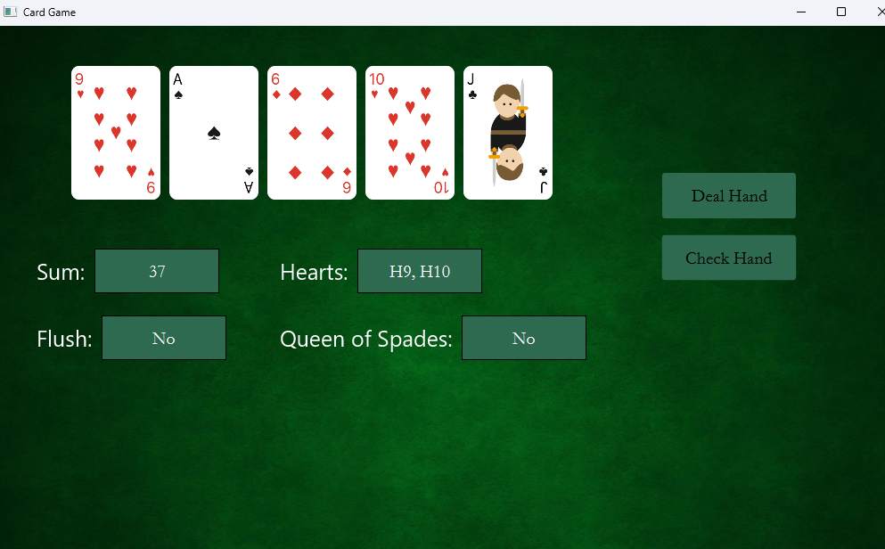
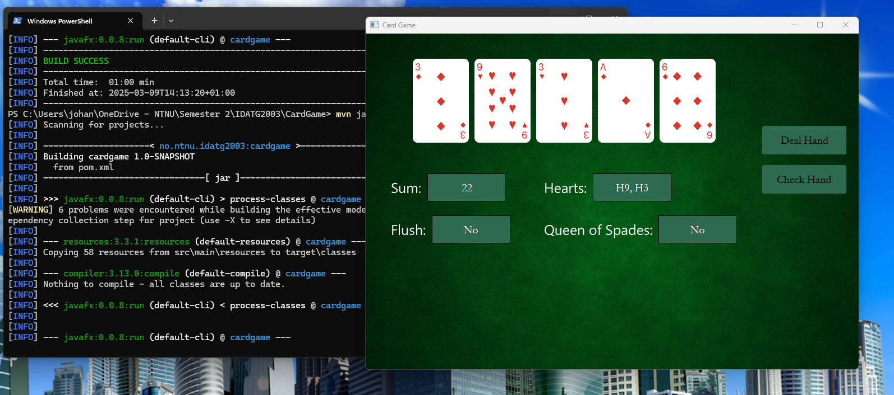

# CardGame Application

By **Johannes Nupen Theigen**

## Project Description
This project is a simple card game application made as a mandatory
assignment for the Programming 2 course at the Norwegian University of Science and Technology (NTNU)
to learn about the Model-View-Controller (MVC) design pattern and graphical user interfaces (GUI) in Java using the JavaFX library.

The application is a simple card game where the user can click on a button that deals five cards from a deck of cards.
The cards are displayed in a window with a background image of a poker table. The cards are displayed as images of playing cards.
Information about the cards in the hand such as the sum, amount of hearts, if the hand is a flush, and if the hand 
contains a queen of spades.


Screenshot of the CardGame application

## Project Structure

```aiignore
|   pom.xml
|   README.md
+---src
|   +---main
|   |   +---java
|   |   |   +---app
|   |   |   |       Main.java
|   |   |   +---controller
|   |   |   |       CardGameController.java
|   |   |   +---model
|   |   |   |       CardFaceManager.java
|   |   |   |       CardManager.java
|   |   |   |       DeckHand.java
|   |   |   |       DeckOfCards.java
|   |   |   |       PlayingCard.java
|   |   |   \---view
|   |   |           CardGameView.java
|   \---test
|       \---java
|           \---model
|                   CardFaceManagerTest.java
|                   DeckHandTest.java
|                   DeckOfCardsTest.java
|                   PlayingCardTest.java
    |   +---app
    |   +---controller
    |   +---model
    |   \---view
```

## How to run the project

The project can be run by running the Main.java file in the src/main/java folder in the IntelliJ IDE. 

Alternatively, the project can be run by running the following command in the terminal:

```shell
mvn clean install
mvn javafx:run
```
Screenshots below show the application running in the command line.




## How to run the tests
The unit tests are managed with Apache Maven.
JUnit5 dependencies are specified in the pom.xml file.

To run the tests:

In IntelliJ, use the Maven plugin and select the test phase in the Build Lifecycle.
Alternatively, `run mvn` test in the terminal

Screenshots below show the tests running in the command line.
